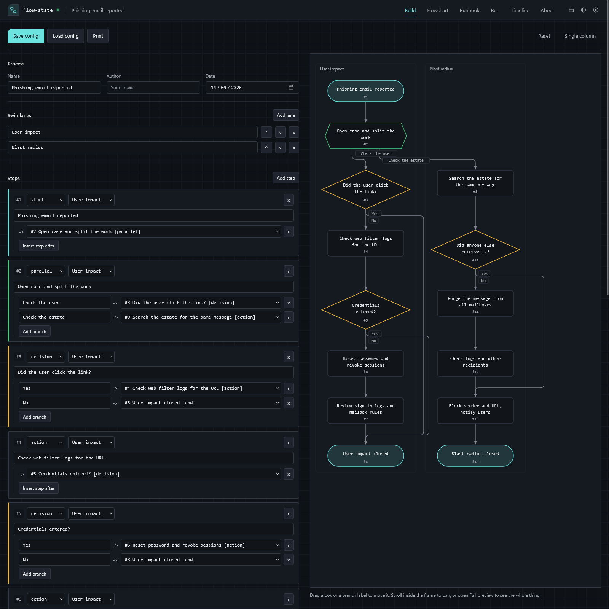
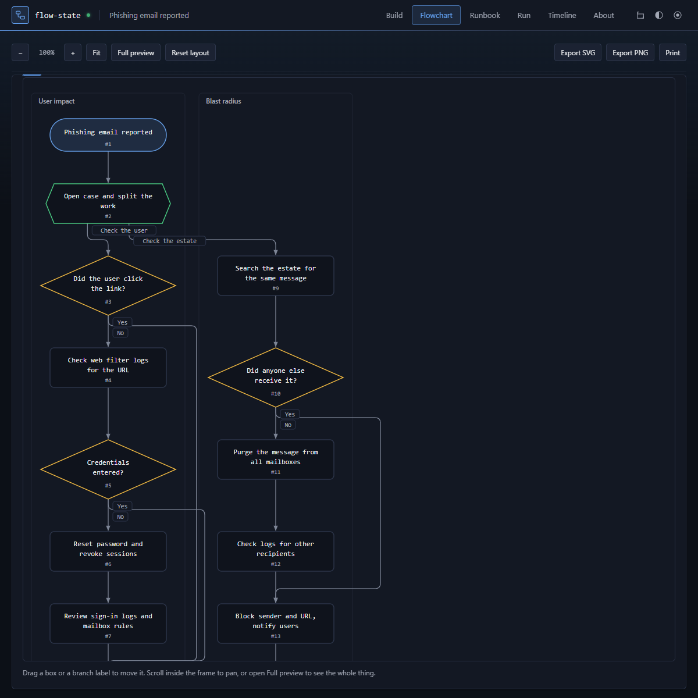
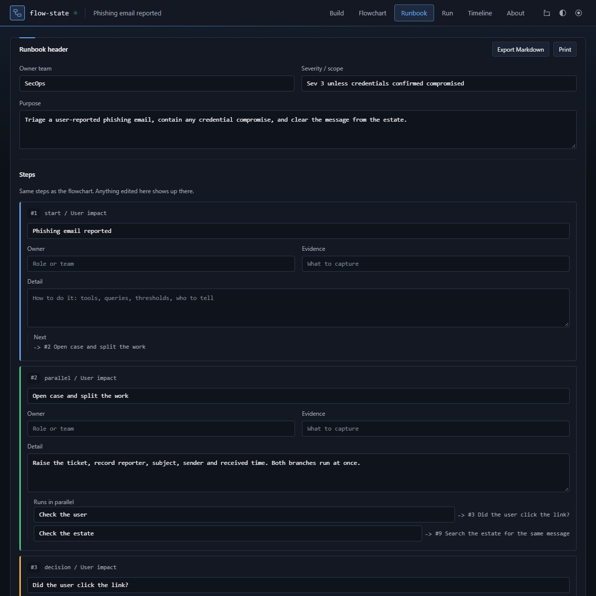
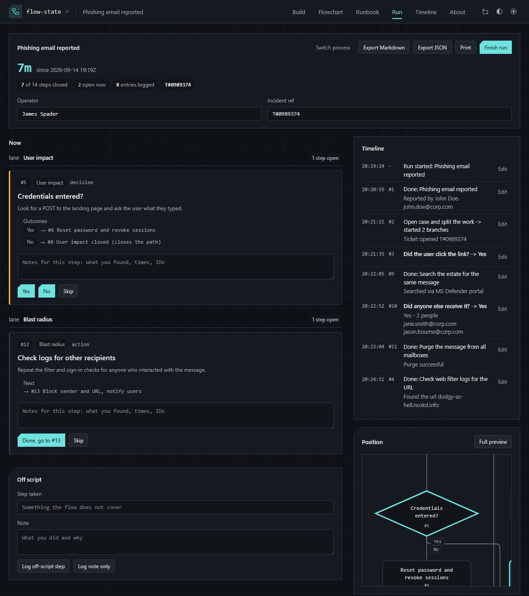
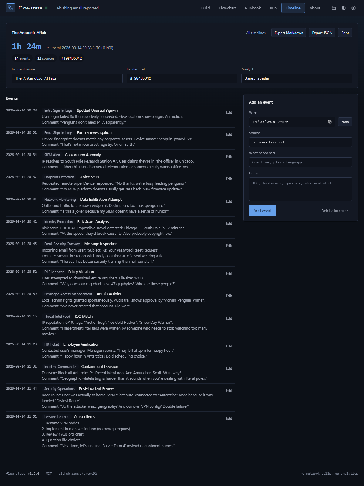

# flow-state

Build a process as a flowchart, get a runbook out of it, then follow it step by step when it
matters. Plus a plain incident timeline for the days nothing goes to plan. One HTML file, no
build step, no dependencies, no network calls. Open it from disk or serve it as a static page.
Light and dark, switched from the header.

## What it does

### Build

- Steps are cards: give each one a label, a type and a swimlane, then point it at what comes next.
- Types: `start`, `action`, `decision` (path splits on an outcome), `parallel` (several things happen at once), `end`.
- Swimlanes are columns, for separate workstreams running alongside each other.
- Split view docks the chart beside the steps in even halves on screens wider than 1200px. It follows you
  between the two tabs and the preference sticks. Under 1200px it drops back to one column.

### Flowchart

- Laid out automatically from the step list, no positioning needed. Drag a box or a branch label to move it;
  Reset layout clears every nudge.
- Edges that skip past a row route around the side instead of through the boxes in between, and branch
  labels sit in their own tag so they stay readable.
- Scroll inside the frame, zoom, Fit, or open Full preview for the whole chart at once.
- Export SVG or PNG, or print.

### Runbook

- The same steps with the detail a runbook needs: owner, evidence to capture, and how to actually do it.
- Editing a label or an outcome here updates the flowchart, and the other way round.
- Export Markdown writes the whole runbook out as one `.md` file, or print it straight from the tab.

### Run

- Import a config (drag the JSON in, or add the flow you are building) and it stays in a list in this browser.
- Once a run starts the process list collapses out of the way, leaving the live steps, a running clock and
  the log. Switch process brings it back.
- Only the steps that are live right now are shown, with the owner, the detail and what evidence to capture.
- Live steps are grouped under their swimlane, so parallel workstreams stay visibly separate.
- Each live step previews where every branch leads before you pick one.
- Decisions show one button per outcome. Parallel steps open every branch at once. Each step takes a note
  before you close it, and every choice, note and skip is timestamped.
- Off-script actions get logged against the timeline rather than being lost.
- Timeline entries can be corrected: edit the time, the text or the note, or delete an entry. Changed
  entries are marked as edited and the log re-sorts by time.
- Position view shows the flowchart with the live steps outlined and closed ones dimmed.
- Runs survive a refresh. Export the record as Markdown or JSON, or print it.

### Timeline

- For incidents that do not follow a process. No template, no steps to close, just the record.
- Each event takes a time, a source (where you saw it), a one-line summary and as much detail as you want.
  Now stamps the current time; sources you have already used come back as suggestions.
- Events sort themselves by time, so you can log what you learn in the order you learn it and still get a
  clean sequence. Any event can be edited or deleted, and edits are marked.
- The header shows the span from first to last event, the event count and how many sources you have pulled from.
- Keep several incidents side by side. Export Markdown (with a sources-used summary) or JSON, or print.

## Config files

Save config writes the whole process (metadata, lanes, steps, runbook detail, layout nudges) to one JSON
file. Load config reads it back. Run records and incident timelines export separately, as Markdown or JSON.

`Ctrl+S` saves, `Ctrl+O` loads, `Esc` closes the preview.

## Where the data goes

Nowhere. Work is kept in this browser's localStorage until you reset. Imported processes, run records and
incident timelines are stored separately from the flow you are building, so resetting the builder leaves
them alone. The only way data leaves the page is a file you download yourself, and the CSP in the head
blocks network access.

## Licence

MIT. See LICENSE.
